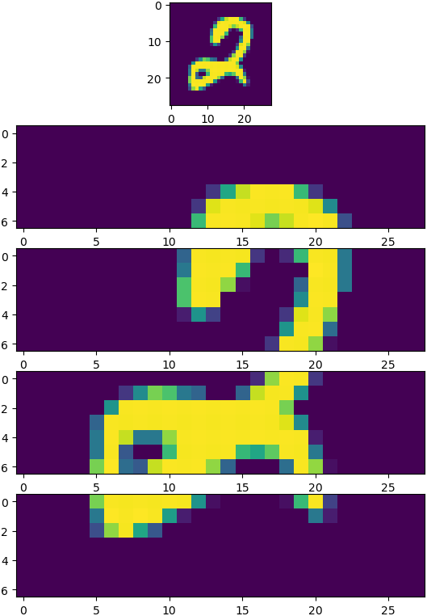
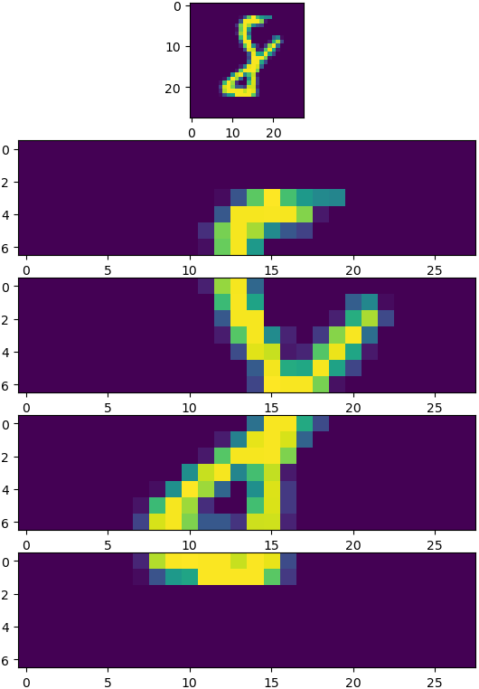
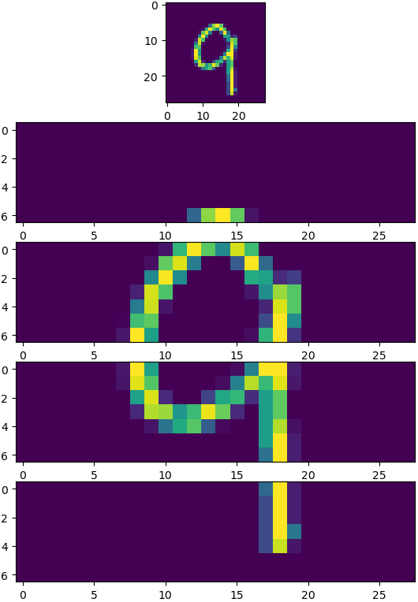
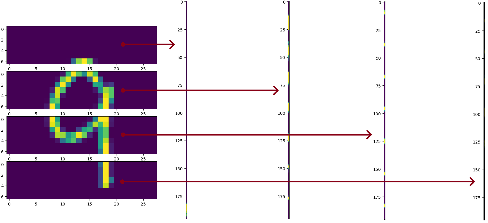

# FruitNet

The following README is a breakdown of each of the key components of the above repository.

1. [  Project Description  ](#desc)
2. [  Data Handling  ](#data)
    1. [  Loading in Data  ](#loading)
    2. [  Viewing Data  ](#viewing)
3. [  Architecture  ](#arch)
    1. [  Subnets  ](#sub)
    2. [  The Supernet  ](#sup)
4. [  Example Network(s)  ](#ex)
    1. [  _FruitNet_v1.0_  ](#fn1)
5. [  FruitNet Vision  ](#fnv)
6. [  References  ](#ref)

<a name="desc"></a>
## 1. Description

FruitNet is a deep learning framework that enables users to define and train variations of the typical fully-connected model to recognize square, grayscale image contents (otherwise stated, FruitNet is an image classification framework that applies specifically to images that are both square and grayscale (more on this [here](#data))). The project draws inspiration from _M.D. Zeiler_ and _R. Furgus_' paper, _Visualizing and Understanding Convolutional Neural Networks_ (to which the hyperlink is found [here](#ref)), which seeks to identify (to an extent) what exactly it is that convolutional layers are learning, by examining the activations produced by particular nodes in a convolutional layer (belonging to a pretrained convolutional neural network (CNN)), across large datasets. Noting that nodes in convolutional layers may be regarded as 'seeing' only limited portions of the entire image input into the network, FruitNet handles images as follows: FruitNet splits input images into horizontal strips (each of equal height, spanning along the entire width of the input image), flattens said strips, and subsequently trains a series of fully-connected neural networks (FCNNs) to make sense of each of the strips into which we've split our image. We call such networks **subnets** in this project. From here, FruitNet feeds the activations produced by these subnets into a greater FCNN, called a **supernet** in this project, to obtain finally a classification of the original input image (more on the intricacies of this process [here](#architecture)).

A reasonable question at this point is why go through all the hassle of splitting our image up into strips and training separate subnets to make sense of the contents of the aforementioned strips, instead of just feeding the entire (flattened) input image into a single FCNN? The answer lies in the fact that the purpose of thsi project is not to produce the most efficient image classification framework we can. Instead, the purpose of this project is to replicate the process presented in the aforementioned paper on CNNs, using FCNNs, instead. After all, this project is meant to be purely educational.
<a name="data"></a>
## 2. Data Handling

Note that there are two files in this repository, _dataset_operations.py_, and _fruitnet_api.py_, that collectively contain everything one might need to know regarding the way in which FruitNet handles its data. Nevertheless, we will utilize this space to provide some further visual intuition for what exactly goes on behind the scenes.

<a name="loading"></a>
### i. Loading in Data

The FruitNet API loads in data from _.h5_ files (using the _h5py_ library, of course) by reading from two datasets: an input feature dataset, and a corresponding label dataset. The input feature dataset is necessarily of the shape `(m,w,w,1)`, where `m` is the number of images in the dataset, `w` is the width of our image (and therefore also the height of our image, since our images are necessarily square), and the final dimension of the dataset shape being `1` is a consequence of the fact that we are dealing exclusively with grayscale images. Similarly, the corresponding label dataset is necessarily of shape `(c,m)`, where `m` maintains its definition, and `c` is the number of classes to which our images may belong.

<a name="viewing"></a>
### ii. Viewing Data
As far as loading in data is concerned, the above is all one needs to know. From here, let us consider another useful data-oriented method of the FruitNet API, namely the `viewData` method. This method allows us to extract from the test set (which is automatically generated upon loading in data using the above method) a single image (at random) and split said image in accordance with `split`, the lone parameter assumed by `viewData` that dictates the number of strips into which the aforementioned image will be split. Examples of the above process look as follows.

<p align="center">


</p>

The above gives us an idea of how data is, finally, presented to a ready-to-train network, with the exception of one final step in our data preparation journey, namely flattening. To this end, since it does not exactly matter to us in which way we achieve our flattening goals, we simply _NumPy_'s `reshape` method (applicable to `np.array` objects). The following process illustration shows demonstrates how to process works, to an extent.

<p align="center">

</p>

From here, we will turn our attention to a discussion of the architecture of our model
<a name="arch"></a>
## 3. Architecture

<a name="sub"></a>
### i. Subnets
>There is a unique subnet for each of the strips into which we divide images, and each subnet learns how to make sense of the strip in the same position of each image (for this reason, splitting the images in our dataset into four strips results in a total of four subnets). Note that, given this design, we may regard each subnet as only 'seeing' a select portion of the input image (namely, its allocated strip), which is primarily where the similarity between this project and the aforementioned paper on CNNs comes from. Each subnet has the same architecture, meaning the user is only required to adjust the hyperparameters corresponding to a single subnet to adjust the architecture of each of the subnets in the same model. There are, however, some constraints. In particular, the user does not get to decide on the final layer's activation function (or shape, since the inner workings of the FruitNet API does this on the user's behalf). Instead, the framework takes the activation function of the aforementioned layer to be the Softmax activation function, on the user's behalf. This fact, in addition to the fact that user cannot assign the Softmax activation function to hidden layers, means that the user has a choice of either the ReLU activation function, or the Sigmoid activation function, for each hidden layer in a subnet. The user is also not required to specify the dimensions of the input layer, since the inner workings of the FruitNet API will do this for them, assuming they've loaded in appropriate data.

<a name="sup"></a>
### ii. The Supernet

>Each FruitNet model has only one supernet. Any inputs to the supernet (whether it be during training or inference) is necessarily a concatenation of final layer activations produced by the subnets in the same model. For this reason, the supernet tends to be both shallower and smaller than subnets in the same model, meaning majority of the model's complexity may be found in the subnets. The aforementioned constraints that apply to subnets in a model applies also to the supernet of a model, as does the choice of either the ReLU activation function or the Sigmoid activation function for any of the hidden layers in the supernet. Again, the user does not need to specify the input layer shape, for the exact same reasons as those listed above (in actual fact, a lot of the dimension-aligning that accompanies typical deep learning tasks is taken care of by the inner workings of the FruitNet API).

With all of this theory in place, let us put together a visual explanation of the way in which information is propagated forward along our model. We have the following illustration.


From the above illustration, we see the process of splitting the input image into four strips (for the sake of the example, although in general we may be able to split our input image into more than just four strips, of course). We see also when we apply the flattening process to each of the strips, before feeding each of the flattened strips into their respective subnets. We see how, from here, the subnetse each produce an activation, said activations are concatenated into a single activation, which then serves as an input to the supernet of the same model. During training each of the above networks is, in some sense, trained individually on the training set. This illustration provides, to an extent, the most whollistic overview of the exact way in which FruitNet models manage to model data.

<a name="ex"></a>
## 4. Example Network(s)

<a name="fn1"></a>
### i. FruitNet_v1.0

This is the first of the models built using the FruitNet API (hence the name), and it seeks to model the data in the MNIST dataset of handwritten digits by training on a (very) small subset of said dataset (a subset of 19,999 elements from the original dataset, with (roughly) 5% of said subset set aside to serve the purposes of a test set (there are exactly 999 images in the test set)). Our model was trained using gradient descent, a learning rate of 0.05, subject to learning rate decay, over 256 epochs, with a mini batch size of 128. We split our training set (and therefore also our test set) into four strips (each of width 7, given that the images in the aforementioned MNIST dataset are of shape 28 by 28), resulting in a model comprised ultimately of 4 subnets, and a single supernet, as we'd expect. The following exerpt is from the _fruitnet_reimagined.ipynb_ notebook.

```
==================================================
NETWORK ARCHITECTURE SUMMARY
==================================================


SUBNET SUMMARY
--------------------------------------------------
Input Layer:
- Name: N/A
- No. of Input Nodes: 196
- Activation Function: N/A
--------------------------------------------------
Hidden Layer 1:
- Name: sub_hidden_1
- No. of Hidden Nodes: 128
- Activation Function: relu
--------------------------------------------------
Output Layer:
- Name: N/A
- No. of Output Nodes: 10
Activation Function: softmax
--------------------------------------------------


SUPNET SUMMARY
--------------------------------------------------
Input Layer:
- Name: N/A
- No. of Input Nodes: 40
- Activation Function: N/A
--------------------------------------------------
Output Layer:
- Name: N/A
- No. of Output Nodes: 10
Activation Function: softmax
--------------------------------------------------


--------------------------------------------------
Cost after epoch 1: 0.38809186721134104
Error on final mini batch in this epoch: 29.88071523335984
--------------------------------------------------
--------------------------------------------------
Cost after epoch 2: 0.32585646098937665
Error on final mini batch in this epoch: 18.89822365046136
--------------------------------------------------
...
--------------------------------------------------
Cost after epoch 255: 0.007330821959976451
Error on final mini batch in this epoch: 0.0
--------------------------------------------------
--------------------------------------------------
Cost after epoch 256: 0.03381013238254956
Error on final mini batch in this epoch: 13.36306209562122
--------------------------------------------------
The network's performance on the test set yields an error of roughly 29.847795410899124
```

We see therefore from the above that _FruitNet_v1.0_ attains a test set accuracy of roughly 70%, which is by no stretch of the imagination a state-of-the-art result (in fact, for an account of the _actual_ state-of-the-art results attained using the entirety of the aforementioned MNIST dataset, see <a href="http://yann.lecun.com/exdb/mnist/">here</a>), but for the purposes of the area of deep learning from which this project draws inspiration, it is certainly sufficient.

The code utilized to attain these results may be found in _FruitNet_v1.0.py_, and, in addition, the exact _.h5_ file containing the dataset on which FruitNet_v1.0 was trained can be found in _training_set.h5_. Both of the aforementioned files are found in _/fruitnet_v1_. You may attain similar results using the same hyperparameters, but do remember that the shuffling of our dataset occurs randomly, meaning our results may not always agree exactly.

<a name="fnv"></a>
## 5. FruitNet Vision

FruitNet Vision is a prospective, separate project to FruitNet (and may be regarded as a "child project" of FruitNet) that will seek ultimately to achieve the goals laid out in the description of this project: to investigate each of the subnets of a model trained using the FruitNet API, in an attempt to identify what each subnet has "learned" about the portion of each image in the training set it has "looked at". To this end, we will of course require a network pretrained using the FruitNet API, and although we have such a network in _FruitNet_v1.0_, I don't image it'll be particularly exciting to investigate the aforementioned concerns using 28 by 28 images of handwritten digits. For this reason, we will instead utilize a different dataset to the end of realizing the FruitNet Vision project. Once FruitNet Vision is live, a hyperlink to said project will be included in this section of the project debrief, so, if you happened to find the work done here interesting, do be sure to check back regularly for any updates!

Thank you for your interest. Stay safe, and keep coding!

<a name="ref"></a>
## 6. References

1. <a href="https://arxiv.org/pdf/1311.2901.pdf">Zeiler, M.D. and Fergus, R., 2014, September. Visualizing and understanding convolutional networks. In European conference on computer vision (pp. 818-833). Springer, Cham.</a>
2. <a href="http://yann.lecun.com/exdb/mnist/">Yann.lecun.com. 2021. MNIST Handwritten Digit Database, Yann Lecun, Corinna Cortes And Chris Burges. [online] Available at: <http://yann.lecun.com/exdb/mnist/> [Accessed 11 January 2021].</a>
